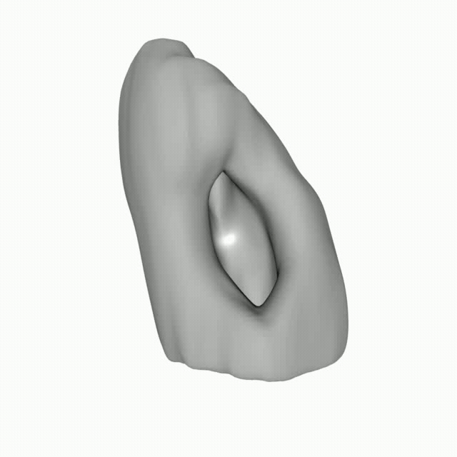
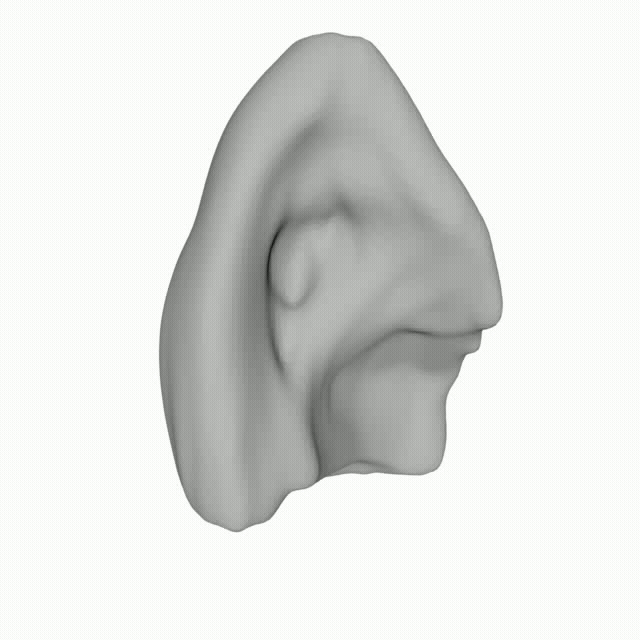
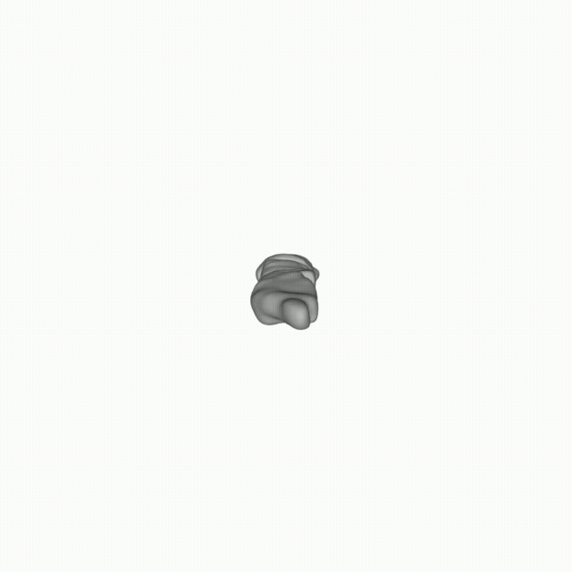

<div align="center"> 
<h1> MedGS: Learning 3D Structures from Sequential Medical Imaging with Gaussian Splatting </h1>

__Abstract:__ Multi-modal three-dimensional (3D) medical imaging data, derived from ultrasound, magnetic resonance imaging (MRI), and computed tomography (CT), provide a widely adopted approach for non-invasive anatomical visualization. However, accurate modeling depends on surface reconstruction and frame-to-frame interpolation, where traditional methods often struggle with image noise and incomplete information between sparse frames. To address these challenges, we present MedGS, a novel framework based on Gaussian Splatting (GS) designed for high-fidelity 3D anatomical reconstruction. 
Uniquely, MedGS employs a multi-task architecture that simultaneously performs frame interpolation and segmentation using a unified geometric representation. By coupling these tasks, the model leverages dense signals from image synthesis to regularize the geometry, enabling high-quality surface extraction even from a limited number of input frames. 
Specifically, medical data are modeled as Folded-Gaussians with dual color attributes, supported by an In-Between Frame Regularization (IBFR) mechanism. Experimental results demonstrate that MedGS achieves higher metric scores than implicit neural representations and improves interpolation quality.

<br>

</div>

# Example results

<div align="center">

<table>
  <!-- moved previous last row to be first, and added aortas.gif in the same row -->
  <tr>
    <td align="center">
      <br/>
      <strong>Kidney with cancer</strong>
    </td>
    <td align="center">
      <br/>
      <strong>Aortas</strong>
    </td>
  </tr>

  <tr>
    <td align="center">
      <br/>
      <strong>Kidney</strong>
    </td>
    <td align="center">
      <br/>
      <strong>Lung</strong>
    </td>
  </tr>

  <tr>
    <td align="center">
      <br/>
      <strong>Vertebrae</strong>
    </td>
    <td align="center">
      <br/>
      <strong>Heart</strong>
    </td>
  </tr>
</table>
</div>

## Table of Contents
- [Example results](#example-results)
  - [Table of Contents](#table-of-contents)
- [Installation Guide](#installation-guide)
    - [Requirements](#requirements)
    - [1. Download the Repository](#1-download-the-repository)
    - [2. Set Up a Virtual Environment](#2-set-up-a-virtual-environment)
    - [3. Install PyTorch and torchvision](#3-install-pytorch-and-torchvision)
    - [4. Install Project Submodules](#4-install-project-submodules)
    - [5. Install Additional Requirements](#5-install-additional-requirements)
- [Tutorial](#tutorial)
  - [1. Training](#1-training)
    - [Image / photometric training (default)](#image--photometric-training-default)
    - [Segmentation training (binary masks)](#segmentation-training-binary-masks)
    - [Joint training (shared geometry + img/seg heads)](#joint-training-shared-geometry--imgseg-heads)
    - [Segmentation-head-only training (freeze geometry + image head)](#segmentation-head-only-training-freeze-geometry--image-head)
    - [Expected input layout](#expected-input-layout)
    - [Training options](#training-options)
  - [2. Rendering](#2-rendering)
    - [Examples](#examples)
    - [Rendering options](#rendering-options)
    - [Output folders](#output-folders)
  - [3. Creating mesh](#3-creating-mesh)
    - [Expected input layout](#expected-input-layout-1)
    - [Run](#run)

# Installation Guide


Follow the steps below to set up the project environment.

### Requirements
- CUDA-ready GPU with Compute Capability 7.0+
- CUDA toolkit 12 for PyTorch extensions (we used 12.4)

### 1. Download the Repository

### 2. Set Up a Virtual Environment
Create and activate a Python virtual environment using Python 3.8.

```
python3.8 -m venv env
source env/bin/activate
```

### 3. Install PyTorch and torchvision
Install the PyTorch framework and torchvision for deep learning tasks.

```
pip3 install torch torchvision
```

### 4. Install Project Submodules
Install the necessary submodules for Gaussian rasterization and k-nearest neighbors.

```
pip3 install submodules/diff-gaussian-rasterization
pip3 install submodules/simple-knn
```

### 5. Install Additional Requirements
Install all other dependencies listed in the `requirements.txt` file.

```
pip3 install -r requirements.txt
```

# Tutorial

## 1. Training

The training script supports three pipelines:

- `img` — photometric/image reconstruction training (default)
- `seg` — binary segmentation training
- `joint` — joint image + segmentation training with shared geometry and dual heads

### Image / photometric training (default)

```
python3 train.py -s <img_dataset_dir> -m <output_dir>
```

### Segmentation training (binary masks)

```
python3 train.py -s <seg_dataset_dir> -m <output_dir> --pipeline seg
```

### Joint training (shared geometry + img/seg heads)

```
python3 train.py \
  -s <img_dataset_dir> \
  -m <output_dir> \
  --pipeline joint \
  --seg_source_path <seg_dataset_dir>
```

### Segmentation-head-only training (freeze geometry + image head)

Use this mode to refine only the segmentation head from a checkpoint. Useful if you previously trained single image head.

```
python3 train.py \
  -s <seg_dataset_dir> \
  -m <output_dir> \
  --pipeline seg \
  --seg_head_only \
  --start_checkpoint <output_dir>/chkpntXXXXX.pth
```

### Expected input layout

Before training, convert your data into individual frames (`0000.png`, `0001.png`, ...).

Each dataset root should look like:

```
<data_root>
├── original/
│   ├── 0000.png
│   ├── 0001.png
│   └── ...
└── mirror/
```

- `original/` contains input frames.
- `mirror/` is used by the camera pipeline.

For `--pipeline joint`, you must provide:
- one dataset root for images via `-s`
- one dataset root for masks via `--seg_source_path`

Both datasets must have:
- the same number of frames
- identical ordering / indexing (`0000.png`, `0001.png`, ...)

### Training options

- `--pipeline {img,seg,joint}`  
  Select training mode.

- `--seg_head_only`  
  Valid with `--pipeline seg`. Freezes geometry and image head, trains only the segmentation head.

- `--seg_source_path <path>`  
  Required for `--pipeline joint`. Path to the segmentation dataset root.

- `--lambda_img <float>`  
  Weight of the image loss in joint training (default: `1.0`).

- `--lambda_seg <float>`  
  Weight of the segmentation loss in joint training (default: `1.0`, you can get good results using `2` or `3`).

- `--start_checkpoint <path>`  
  Resume from checkpoint. In joint mode, image-only checkpoints are also supported (the segmentation head is initialized and optimizer is rebuilt).

- `--save_xyz`  
  Save Gaussian xyz positions periodically to `<output_dir>/xyz/`.

- `--random_background`  
  Randomize background during training (useful for transparent-background data).

- `--poly_degree <int>`  
  Polynomial degree of folded Gaussians.

- `--batch_size <int>`  
  Batch size (default: `3`).

- `--test_iterations`, `--save_iterations`, `--checkpoint_iterations`  
  Control evaluation, full saves, and checkpoint saves.

## 2. Rendering

Render test views from a trained model.

The renderer supports:
- `img` — render image head output
- `seg` — render segmentation output
- `both` — render both image and segmentation outputs

```
python3 render.py --model_path <model_dir> --interp <interp> --pipeline 
```

### Examples

Render image output:
```
python3 render.py --model_path <model_dir> --pipeline img
```

Render segmentation output:
```
python3 render.py --model_path <model_dir> --pipeline seg
```

Render both outputs:
```
python3 render.py --model_path <model_dir> --pipeline both
```

Render a specific checkpoint:
```
python3 render.py --model_path <model_dir> --iteration 30000
```

Render the latest checkpoint automatically (`--iteration -1`, default):
```
python3 render.py --model_path <model_dir> --iteration -1
```

Reduce memory usage by rendering in chunks:
```
python3 render.py --model_path <model_dir> --pipeline both --chunks 4
```

### Rendering options

- `--model_path <path>`  
  Path to the training output directory.

- `--iteration <int>`  
  Checkpoint iteration to load. `-1` selects the latest `chkpnt*.pth`.

- `--interp <int>`  
  Interpolation multiplier (default: `1`).

- `--pipeline {img,seg,both}`  
  Output type(s) to render.

- `--chunks <int>`  
  Split rendering across chunks to reduce memory usage.

- `--extension <str>`  
  Output file extension (default: `.png`).

- `--mask_path <path>` / `--generate_points_path <path>`  
  Optional advanced rendering controls.

### Output folders

Rendered images are saved to:

- `<model_dir>/render_img/` for image renders
- `<model_dir>/render_mask/` for segmentation renders

Files are named like:

```
00000_0.png
00001_0.png
...
```

If `--interp > 1`, each frame can produce multiple outputs:
- `00000_0.png`
- `00000_1.png`
- ...

If you render with `--pipeline seg` and the checkpoint does not contain a dedicated segmentation head, rendering falls back to the image head.

## 3. Creating mesh

Build a 3D mesh (`.ply`) from rendered segmentation frames.

The mesh script uses marching cubes. If a NIfTI file is present in a case folder, its voxel spacing can be used.

### Expected input layout

`--input` should point to a directory where each subfolder is one case/model.

If your mesh pipeline expects rendered masks, point it to the segmentation render folder (`render_mask/`) instead of the old `render/` path.

### Run

```
python3 slices_to_ply.py \
  --input <input_root> \
  --output <out_dir> \
  --thresh 150
```

- `--input` — parent directory with case subfolders
- `--output` — destination directory for meshes (`<case>.ply`)
- `--thresh` — iso-level for marching cubes (PNG intensity scale)
- `--inter` — interpolation scale (if supported by your `slices_to_ply.py`)


