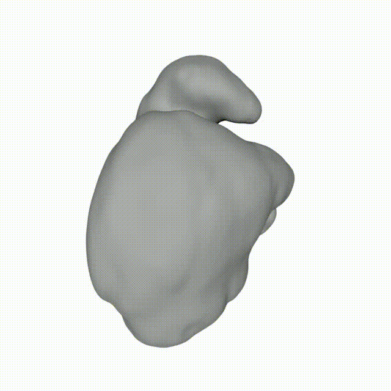

<div align="center"> 
<h1> MedGS: Gaussian Splatting for Multi-Modal 3D Medical Imaging </h1>

Multi-modal three-dimensional (3D) medical imaging data, derived from ultrasound, magnetic resonance imaging (MRI), and potentially computed tomography (CT), provide a widely adopted approach for non-invasive anatomical visualization. Accurate modeling, registration, and visualization in this setting depend on surface reconstruction and frame-to-frame interpolation. Traditional methods often face limitations due to image noise and incomplete information between frames. To address these challenges, we present MedGS, a semi-supervised neural implicit surface reconstruction framework that employs a Gaussian Splatting (GS)-based interpolation mechanism. In this framework, medical imaging data are represented as consecutive two-dimensional (2D) frames embedded in 3D space and modeled using Gaussian-based distributions. This representation enables robust frame interpolation and high-fidelity surface reconstruction across imaging modalities. As a result, MedGS offers more efficient training than traditional neural implicit methods. Its explicit GS-based representation enhances noise robustness, allows flexible editing, and supports precise modeling of complex anatomical structures with fewer artifacts. These features make MedGS highly suitable for scalable and practical applications in medical imaging.

<!-- TODO -->
<br>

<div align="center">
  
  <p><em>Example reconstruction results from MedGS.</em></p>
</div>

</div>


## Table of Contents
- [Installation Guide](#installation-guide)
    - [Requirements](#requirements)
    - [1. Download the Repository](#1-download-the-repository)
    - [2. Set Up a Virtual Environment](#2-set-up-a-virtual-environment)
    - [3. Install PyTorch and torchvision](#3-install-pytorch-and-torchvision)
    - [4. Install Project Submodules](#4-install-project-submodules)
    - [5. Install Additional Requirements](#5-install-additional-requirements)
- [Tutorial](#tutorial)
    - [1. Training](#1-training)
      - [Other options](#other-options)
    - [2. Rendering](#2-rendering)
    - [3. Creating mesh](#3-creating-mesh)
      - [Expected input layout](#expected-input-layout)
      - [Run](#run)


# Installation Guide

_Whole setup can be also done by running run.sh. It installs the environment, runs training, render and mesh generation. Mesh can be visualized using:_ ```python vismesh.py ./output/mesh/prostate.ply```


Follow the steps below to set up the project environment:
### Requirements
 - CUDA-ready GPU with Compute Capability 7.0+
 - CUDA toolkit 12 for PyTorch extensions (we used 12.4)

### 1. Download the Repository

### 2. Set Up a Virtual Environment
Create and activate a Python virtual environment using Python 3.8.
```bash
python3.8 -m venv env
source env/bin/activate
```

### 3. Install PyTorch and torchvision
Install the PyTorch framework and torchvision for deep learning tasks.
```bash
pip3 install torch torchvision
```

### 4. Install Project Submodules
Install the necessary submodules for Gaussian rasterization and k-nearest neighbors.
```bash
pip3 install submodules/diff-gaussian-rasterization
pip3 install submodules/simple-knn
```
### 5. Install Additional Requirements
Install all other dependencies listed in the `requirements.txt` file.
```bash
pip3 install -r requirements.txt
```


# Tutorial
### 1. Training
```sh
python3 train.py -s <dataset_dir> -m <output_dir> #for usg, mri or simmilar images
or
python3 train.py -s <dataset_dir> -m <output_dir> --pipeline seg #for training on binary segmentations
```
Before training, your data needs to be converted to individual frames (0000.png, 0001.png, ...).
The data directory needs to have a structure like this:
```
<data>
|---<original>
|   |---0000.png
|   |---0001.png
|   |---...
|---<mirror>
```

#### Other options
 
* ```--random_background``` Randomizes background during training. Use it if you want to train MedGS on a video with a transparent backround.
* ```--poly_degree <int>``` Use to change polynomial degree of folded gaussians.
* ```--batch_size <int>``` Batch size.

### 2. Rendering
```sh
python3 render.py --model_path <model_dir> --interp <interp> --pipeline 
```
* ```--model_path``` Path to the model directory.
* ```--interp``` Multiplier for the rendered frames (interpolation). Use ```1``` for the original number of frames (default), ```2``` for doubling the frames, etc. We achieved good results with around 8.
* ```--pipeline``` Rendering from model that was learning on segmentation or img data. Options: img (default), seg.

The rendered images are saved to the ```<model_dir>/render``` directory.

### 3. Creating mesh

Build a 3D mesh (**.ply**) from rendered **segmentation frames**.  
The script uses marching cubes; if a **NIfTI** file is present in a case folder, its voxel spacing is used.


#### Expected input layout
`--input` should point to a directory where **each subfolder is one case/model**.  
For each case the script looks for PNG masks in `seg/render/` and (optionally) one NIfTI (`*.nii*`) next to it:

#### Run
```sh
    python3 slices_to_ply.py \
    --input <input_root> \
    --output <out_dir> \
    --thresh 150
```

- `--input` – parent directory with case subfolders (as above)  
- `--output` – destination directory for meshes (`<case>.ply`)  
- `--thresh` – iso-level for marching cubes (on PNG intensity scale)
- `--inter` - interpolation scale

 <!--  -->


</div>

</section>
